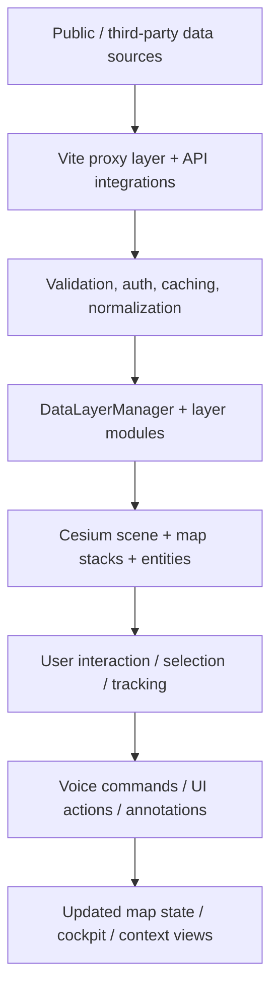

# TerraSynq

Real-time Earth intelligence for geospatial awareness, live monitoring, and voice-guided exploration.

## Overview

TerraSynq is a browser-based 3D Earth intelligence application that brings multiple geospatial and real-world data feeds into a single interactive globe. Built with CesiumJS and Vite, it renders map imagery, live traffic, aircraft, vessels, satellites, landscape context, weather, CCTV, and other operational layers in a single scene.

The project is not a single-source “live satellite control” system. Instead, it combines public and optional feeds with calculated orbital and terrain data into one user-facing interface. Aircraft, vessel, weather, quake, fire, and orbital layers are integrated through a server-side proxy layer and a client-side visualization pipeline that keeps credentials on the server when possible.

## What It Does

TerraSynq fuses geospatial information into a real-time Earth view so a user can inspect a place, understand what is happening nearby, and navigate through layers of context without leaving the globe.

At a high level, it does the following:

- Renders a 3D globe and map stacks with Cesium and Google Photorealistic 3D Tiles when configured
- Visualizes aircraft and maritime traffic as dynamic points, trails, and tracked entities
- Calculates and displays satellite orbits from CelesTrak TLE data using SGP4 propagation
- Shows earthquakes, fires, and other environmental layers from public feeds
- Loads CCTV and public camera catalogs for local situational awareness
- Provides map, terrain, and place-context overlays from OSM, Esri, Google, and local bundled datasets
- Exposes a cockpit-style view, global search/location context, and optional voice-driven commands
- Lets users explore the globe using map stack switching, annotations, clean-view modes, and scene playback tooling

## Key Features

- 3D interactive Earth and photorealistic globe rendering with Cesium
- Aircraft and flight visualization using OpenSky plus adsb.lol fallback data
- Satellite and orbital visualization using CelesTrak TLE propagation
- Vessel tracking with AISStream.io live feeds
- Earthquake monitoring from USGS data
- Weather and local atmospheric/context presentation using Open-Meteo
- Traffic layer with simulated fallback and optional TomTom live tiles
- CCTV/public camera integration for multiple source packs
- Location search and nearby-place/context lookup through Google Places and local reverse-geocode flows
- Map stack switching between Google 3D, Bing imagery, Esri imagery, and OSM
- News and regional briefing data with fallback headline sources
- Internet radio directory and direct-browser playback for selected public stream endpoints
- Voice interaction through OpenAI Realtime over WebRTC and app tool execution
- Cockpit and first-person visual modes with HUD, instruments, and flight-oriented framing
- Contextual scene interrogation and world annotations for named places and map features
- Clean-view and recording-oriented presentation modes
- Performance controls and render prioritization to keep large scene updates manageable

## How It Works

The project follows a layered architecture that moves from external public data into processed geospatial state and then into the 3D globe.

External/public data sources
        ↓
Vite dev-server proxy layer and server-side integrations
        ↓
Normalization, caching, validation, and layer-specific processing
        ↓
Cesium scene state, overlays, entities, and map-stack switching
        ↓
User interaction, tracking, annotations, and voice-driven commands

In the codebase, that flow is implemented through:

- Vite middleware in `vite.config.js` for proxying API calls and handling credentials safely on the server
- Data modules in `src/data/` for flights, traffic, satellites, CCTV, earthquakes, radio, vessels, and local datasets
- `DataLayerManager` in `src/data/manager.js` to register, enable, refresh, and manage live overlays
- `MapStackController` in `src/mapStackController.js` to handle globe and imagery switching
- `src/main.js` as the application bootstrap that initializes Cesium, map stacks, data layers, and scene behavior
- Voice tooling in `src/voice/gevRealtime.js` and the server-side Realtime token route in `vite.config.js`

## Architecture

TerraSynq is a browser-first geospatial intelligence client with a thin server-side proxy layer for external access.

### Frontend

The client is built as an ES module application running in the browser. The main startup logic in `src/main.js` creates the Cesium viewer, loads the active map stack, registers data layers, attaches the HUD, and initializes the voice and annotation systems.

Key frontend modules include:

- `src/main.js` — app bootstrap and viewer setup
- `src/mapStackController.js` — globe and imagery stack management
- `src/data/manager.js` — registration and lifecycle handling for the data layers
- `src/data/*.js` — live-source and processed layer implementations
- `src/voice/gevRealtime.js` — voice session and tool execution lifecycle
- `src/annotations/` — map annotation and boundary markup utilities
- `src/scenes/` — scene playback and cinematic view orchestration
- `src/cockpitCloudEffects.js` and related cockpit modules — first-person cockpit rendering and effects

### Backend / proxy layer

The Vite server in `vite.config.js` performs the real integration work for many upstream APIs. It handles CORS bypass, auth, validation, caching, rate limiting, and data normalization before the frontend consumes the data.

Examples of implemented proxy responsibilities include:

- OpenSky flight data
- CelesTrak satellite TLE access
- Overpass-based map and road queries
- Radio Browser station discovery and click traffic
- TomTom traffic tiles and budget gating
- Launch data from The Space Devs
- NASA FIRMS fire updates
- CCTV media and catalog access
- Terrain-height lookups and weather processing

### Rendering engine and data model

The application is centered on CesiumJS for globe rendering, 3D scene composition, terrain handling, and overlay placement. Layer data is normalized into Cesium entities, point collections, polylines, billboards, and overlay entries before being displayed.

The architecture is intentionally modular:

- each feed is implemented as a data layer module
- data layers register with a shared `DataLayerManager`
- the camera, map stack, and scene state remain separate from source logic
- optional features like voice, cockpit mode, and annotation markup are layered on top without replacing the underlying feed model

### Architecture diagram



## Data Sources & Integrations

TerraSynq uses a mix of live runtime sources, bundled public datasets, and locally cached data. The project documents the specific sources in `DATA_SOURCES.md`, and the implementation in `vite.config.js` and `src/data/` reflects those integrations.

| Data / Layer | Source | Purpose | Data Type |
|---|---|---|---|
| Google Photorealistic 3D Tiles | Google Maps Platform | Primary 3D globe / terrain map experience | Live API + optional credentials |
| Basemap fallback | Esri World Imagery | Keyless basemap fallback and map stack option | Live public tile service |
| Flight tracking | OpenSky Network | Global aircraft positions and flight state | Live API |
| Flight fallback | adsb.lol | Regional aircraft fallback when OpenSky is unavailable | Live API |
| Vessel tracking | AISStream.io | Live maritime position data | Live streaming data |
| Satellite orbits | CelesTrak | TLE catalog and SGP4 orbit propagation | Public orbital data |
| Rocket missions | The Space Devs Launch Library 2 | Recent launch and mission metadata | Public API |
| Earthquakes | USGS | Earthquake layer and events | Live public data |
| Active fires | NASA FIRMS | Active fire detection layer | Live public API |
| Road geometry / traffic | OpenStreetMap Overpass API | Road network used by traffic and context layers | Live public API |
| Traffic flow | TomTom Traffic API | Optional congestion coloring | Optional live API |
| Weather | Open-Meteo | Local weather info and cockpit atmospheric effects | Live public API |
| News | Google News RSS / GDELT | Regional news context for briefing mode | Live / fallback public feeds |
| CCTV | City of Austin, Caltrans, TfL | Camera catalogs and frames for public monitoring | Live public feeds |
| Bikeshare availability | GBFS feeds | Local bike-share availability | Public feeds |
| Radio directory | Radio Browser | Public station metadata and selection | Public directory API |
| Terrain | Re:Earth Terrain / Mapterhorn | Keyless terrain and ellipsoidal height lookup | Public service |
| Local infrastructure datasets | OSM-derived bundled GeoJSON | Datacenters, dams, and submarine cable layers | Bundled local datasets |
| Natural areas | Natural Earth | Offline region polygons for voice annotation and named-area lookup | Bundled dataset |
| Neighborhood boundaries | DataSF | Offline neighborhood polygons for named geography | Bundled dataset |
| Map labels / places | Google Places and OSM/Nominatim | Nearby place and reverse-geocoded local context | Live / public API |

> Third-party data providers may impose their own licensing, attribution, rate limits, authentication requirements, and terms of use. TerraSynq includes these source-level obligations in `DATA_SOURCES.md` and surfaces attribution in the app where required. Some layers are optional, cached, or fallback-based and should not be treated as continuously live or guaranteed complete in all circumstances.

> Satellite positions are displayed based on available orbital data and propagation logic; they are not direct real-time control or telemetry connections to satellites themselves.

## AI & Voice Interaction

TerraSynq includes a real OpenAI Realtime integration for hands-free map and app control. The browser does not hold the real API key. Instead, it requests a short-lived client secret from the server endpoint `/api/realtime/token`, and the server keeps `OPENAI_API_KEY` on the backend.

The implemented voice flow is:

- client requests a Realtime session token from `/api/realtime/token`
- server reads env configuration and resolves the active voice model/tier
- the browser opens a WebRTC Realtime session to OpenAI
- the session is configured with tool definitions for map control and scene actions
- the assistant can call app tools such as layer toggles, map stack changes, camera motion, tracking, radio playback, and context actions
- every turn is backed by live app context and tool execution rather than a generic chatbot loop

The project also exposes a HUD summary endpoint at `/api/openai/hud-summary`, which requests a concise five-word summary from OpenAI using the active scene context. This is a lightweight summary function for the interface, not a full autonomous assistant layer.

The voice capabilities are intentionally app-specific: they control the globe, layers, UI state, camera motion, tracking, and radio behavior according to the tool schema defined in the codebase.

## Technology Stack

| Category | Technology |
|---|---|
| Frontend | JavaScript (ES modules), HTML, CSS |
| Build tooling | Vite |
| 3D globe | CesiumJS |
| Map and imagery | Google Maps Platform, Esri World Imagery, OSM, Bing imagery |
| Orbital math | `satellite.js` with SGP4 propagation |
| Geospatial utilities | `mgrs`, `egm96-universal`, `@mapbox/vector-tile`, `pbf` |
| Server-side integration | Node.js and Vite middleware in `vite.config.js` |
| AI voice | OpenAI Realtime API |
| Testing | Node-based project test scripts and Puppeteer |
| Image processing | Sharp |

## Project Structure

```text
TerraSynq/
├── README.md
├── package.json
├── vite.config.js
├── DATA_SOURCES.md
├── LICENSE
├── SECURITY.md
├── TESTING.md
├── CONTRIBUTING.md
├── CHANGELOG.md
├── index.html
├── style.css
├── public/
│   └── models/
├── config/
│   ├── cctv_sources.austin.json
│   └── cctv_sources.shinjuku.json
├── docs/
│   ├── CURRENT-STATE.md
│   ├── KNOWN-ISSUES.md
│   ├── PERFORMANCE.md
│   └── opensky-auth.md
├── scripts/
│   ├── dev-cctv.sh
│   ├── dev-fresh.sh
│   ├── setup-doctor.mjs
│   ├── qa-*.mjs
│   └── ...
├── src/
│   ├── main.js
│   ├── mapStackController.js
│   ├── data/
│   ├── voice/
│   ├── annotations/
│   ├── scenes/
│   ├── ui.js
│   ├── hud.js
│   └── ...
├── .env.example
├── .gitignore
├── pinokio/
│   ├── start.js
│   ├── install.js
│   └── ...
└── .gev-cache/  (runtime cache; gitignored)
```

Key project areas:

- `src/data/` — layer implementations for flights, traffic, satellites, CCTV, radio, weather, and local datasets
- `src/voice/` — voice session, cost handling, tool execution, and mode logic
- `src/annotations/` — map annotations and whiteboard overlays
- `src/scenes/` — cinematic and playback features
- `vite.config.js` — most upstream integrations, proxies, caching, and server-side auth
- `scripts/` — QA, setup, and utility tooling
- `config/` — source-pack definitions for CCTV layers
- `public/models/` — shipped 3D assets and model provenance information

## Getting Started

### Prerequisites

The project declares this runtime requirement in `package.json`:

- Node.js `>=24.14.0 <25 || >=26 <27`

### Installation

1. Clone the repository.
2. Change into the project directory.
3. Install dependencies:

```bash
npm install
```

4. Configure environment variables using `.env.example` as a template. Keep your real values in a local `.env` file and never commit it.
5. Start the development server:

```bash
npm run dev
```

### Common commands

```bash
npm run build
npm run preview
npm test
npm run doctor
npm run dev:secure
npm run opensky:import
```

The repository uses Vite for the frontend and dev server, and many external integrations rely on runtime configuration and optionally supplied API keys.

## Environment Variables

TerraSynq reads environment variables from a local `.env` file for runtime configuration. Keep `.env` out of Git. A safe `.env.example` can be committed only when it contains placeholders rather than real credentials.

A representative example is below; use placeholders and fill in only what you need locally.

```env
GOOGLE_MAPS_API_KEY=
CESIUM_ION_TOKEN=
OPENAI_API_KEY=
OPENAI_REALTIME_MODEL=gpt-realtime-2
OPENAI_REALTIME_MODEL_MINI=gpt-realtime-2.1-mini
OPENAI_REALTIME_VOICE=marin
OPENAI_REALTIME_REASONING_EFFORT=low
OPENAI_REALTIME_CONTEXT_TOKENS=3000
OPENAI_REALTIME_CONTEXT_RETENTION=0.5
OPENAI_HUD_SUMMARY_MODEL=gpt-5-nano

OPENSKY_AUTH_MODE=anon
OPENSKY_CLIENT_ID=
OPENSKY_CLIENT_SECRET=
LL2_API_TOKEN=

PORT=4173
HOST=localhost

FIRMS_MAP_KEY=
AISSTREAM_API_KEY=
TOMTOM_API_KEY=
TOMTOM_DAILY_TILE_BUDGET=40000
```

### Required vs optional

Required for the full experience:

- `GOOGLE_MAPS_API_KEY` — optional for Google 3D Globe and nearby-place search, but recommended when you want the full photorealistic globe path
- `CESIUM_ION_TOKEN` — optional for Cesium ion imagery routes and some map-stack options
- `OPENAI_API_KEY` — required for OpenAI Realtime voice control and HUD summary calls

Optional but supported:

- `OPENSKY_CLIENT_ID`, `OPENSKY_CLIENT_SECRET` — for OpenSky OAuth access
- `LL2_API_TOKEN` — raises Launch Library 2 request allowance when needed
- `FIRMS_MAP_KEY` — enables the NASA FIRMS live fire layer
- `AISSTREAM_API_KEY` — enables the AIS live vessel feed
- `TOMTOM_API_KEY` — enables TomTom live traffic tiles; the layer also has a keyless simulation fallback
- `HOST` — overrides the default bind address if you intentionally want network access

If a key is absent, the application generally degrades gracefully, but some layers remain unavailable until the relevant credential is configured. The project documents those behaviors in the runtime code and `DATA_SOURCES.md`.

## Notes

- TerraSynq is a real browser application with runtime integrations and optional key-based services; it is designed to run as a local development or self-hosted project rather than as a static demo.
- Many external sources have their own licensing and attribution requirements; follow those terms when you deploy or redistribute the app.
- The repository includes documentation for live data usage, performance, and source attribution. Use those docs together with the code to decide which integrations you want to enable in your environment.

---

TerraSynq brings live geospatial context, environmental monitoring, and interactive Earth intelligence into a single 3D interface. It is designed for exploration and situational awareness, with source-specific caveats and optional integrations clearly separated from the core map experience.
